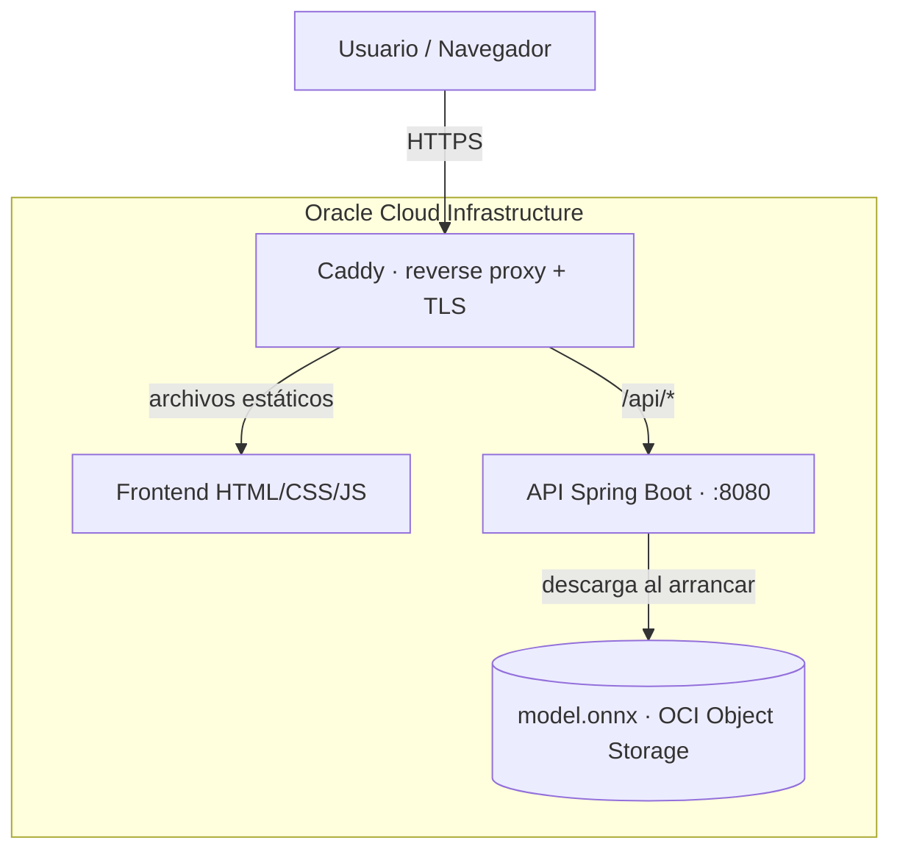

# EnergiAI — Análisis inteligente de consumo energético

**Equipo G9-LATAM-69 · Hackathon ONE (Alura + Oracle)**

EnergiAI analiza el consumo eléctrico de una vivienda, clasifica su perfil de eficiencia
(**Eficiente / Moderado / Ineficiente**), estima una **probabilidad calibrada**, entrega
**recomendaciones** accionables, calcula el **costo mensual** y ofrece un **simulador de ahorro**.
Todo expuesto por una **API REST** y desplegado en **Oracle Cloud Infrastructure (OCI)**.

## Demo en vivo

- **Aplicación:** https://129.151.116.82.nip.io/
- **API (Swagger interactivo):** https://129.151.116.82.nip.io/swagger-ui.html
- **Endpoint:** `POST https://129.151.116.82.nip.io/api/v1/onnx/prediction`

## Arquitectura



El navegador entra por HTTPS a **Caddy**, que sirve el frontend y hace de proxy inverso. Las
peticiones a `/api/*` van a la **API Spring Boot** (servicio permanente en una VM de **OCI
Compute**), que carga el **modelo ONNX** desde **OCI Object Storage** al arrancar.

## Funcionalidades

**Análisis**
- Clasificación del perfil de eficiencia (Eficiente / Moderado / Ineficiente)
- Probabilidad / confianza de la clasificación
- Consumo esperado vs. real y desviación
- Recomendaciones accionables por reglas
- Estimación del costo mensual y anual (tarifa de referencia $0,75/kWh)

**Experiencia**
- Diseño responsive + modo oscuro
- Simulador de ahorro interactivo
- Benchmarking: comparación con hogares similares (percentil)
- Comparación entre períodos: historial persistente por email (Oracle DB), multi-dispositivo
- Exportar informe a PDF · compartir análisis por enlace
- Accesibilidad (foco por teclado, aria-live, textos claros)

## Stack tecnológico

| Capa | Tecnología |
|---|---|
| Ciencia de Datos | Python, Pandas, scikit-learn, skl2onnx |
| Modelo | ONNX (ejecutado con ONNX Runtime en Java) |
| Backend | Java 21, Spring Boot, ONNX Runtime, JPA |
| Frontend | HTML + CSS + JavaScript (Chart.js) |
| Base de datos | OCI Autonomous Database (Oracle) |
| Infraestructura | OCI Object Storage, OCI Compute, Caddy (HTTPS) |

## Ciencia de Datos (resumen)

El sistema no usa la etiqueta original del dataset (se demostró que no refleja eficiencia real)
sino una definición propia basada en el **residual**: cuánto se desvía el consumo real del
**consumo esperado** para la estructura de la vivienda.

- **Modelo A** (regresión) predice el consumo esperado a partir de *normalizadores* (personas,
  superficie, equipos, tipo de inmueble). Las *palancas* (uso en punta, panel solar…) quedan
  fuera para que las buenas decisiones se reflejen como eficiencia.
- **Clasificador** (RandomForest vs Regresión Logística) sobre los 8 campos del contrato.
- **Explicabilidad** (importancia de variables) y **regresión cuantílica** para una probabilidad
  calibrada con bandas de incertidumbre.
- Manejo explícito de **data leakage** y evaluación con *accuracy*, *F1-macro* y matriz de confusión.

Detalle completo en [`docs/CIENCIA_DE_DATOS.md`](docs/CIENCIA_DE_DATOS.md) y en el notebook
`G9_DataScience_analisis_energetico.ipynb`.

## API

`POST /api/v1/onnx/prediction`

```json
// entrada
{ "consumo_kwh": 420, "personas": 3, "superficie_m2": 80, "cantidad_equipos": 12,
  "tipo_inmueble": "Casa", "uso_horario_pico": true, "horas_alto_consumo": 10, "panel_solar": false }
```
```json
// salida
{ "categoria": "Ineficiente", "probabilidad": 0.89,
  "recomendaciones": ["Reducir el uso de equipos durante los horarios pico", "..."],
  "costo_estimado_mensual": 315.0 }
```

Documentación interactiva (Swagger UI dinámico) en `/swagger-ui.html`. Contrato completo en
[`docs/API.md`](docs/API.md).

## Cómo correrlo localmente

**API**
```bash
cd G9-LATAM-Team-69-api-model-test/.../api-energy-model-test
mvn spring-boot:run          # http://localhost:8080
```

**Frontend:** servir la carpeta con cualquier servidor estático, apuntando `API_URL` en
`JS/main.js` a la API.

## Estructura del repositorio

```
G9-LATAM-Team-69-api-model-test/   # API Spring Boot
G9-LATAM-Team-69-frontend/         # Frontend + Swagger
G9_DataScience_analisis_energetico.ipynb   # Notebook de Ciencia de Datos
docs/                              # Documentación
deploy/                            # Caddyfile y servicio systemd
```

## Documentación

- [`docs/API.md`](docs/API.md) — contrato del endpoint
- [`docs/CIENCIA_DE_DATOS.md`](docs/CIENCIA_DE_DATOS.md) — metodología del modelo
- [`docs/DESPLIEGUE_OCI.md`](docs/DESPLIEGUE_OCI.md) — despliegue y mantenimiento
- [`docs/ROADMAP.md`](docs/ROADMAP.md) — estado y próximos pasos
- [`docs/CHANGELOG.md`](docs/CHANGELOG.md) — historial de cambios

## Cumplimiento del reto (MVP)

| Requisito | Estado |
|---|---|
| Clasificación en categorías propias | ✅ |
| Probabilidad | ✅ |
| Recomendaciones | ✅ |
| Estimación financiera ($0,75/kWh) | ✅ |
| API REST + JSON | ✅ |
| Validación y manejo de errores | ✅ |
| Uso de OCI | ✅ Object Storage + Compute |
| Frontend (opcional) | ✅ |

---

**Equipo G9-LATAM-69** — Hackathon ONE, Alura + Oracle.
