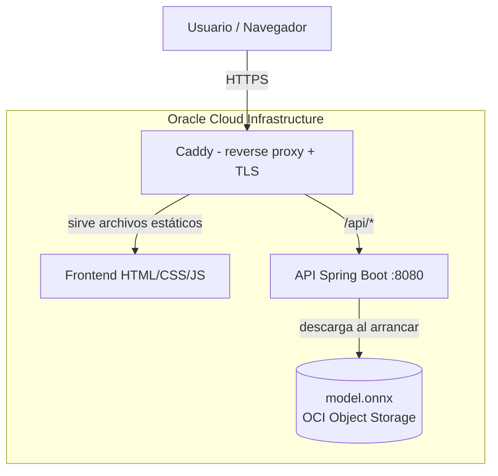

# EnergiAI — Análisis inteligente de consumo energético

**Equipo G9-LATAM-69 · Hackathon ONE (Alura + Oracle)**

Solución que analiza el consumo eléctrico de una vivienda, clasifica su perfil de eficiencia
(**Eficiente / Moderado / Ineficiente**), entrega una **probabilidad de confianza**,
**recomendaciones** de mejora y una **estimación del costo mensual**. Todo expuesto vía API REST
y desplegado en **Oracle Cloud Infrastructure (OCI)**.

## 🌐 Demo en vivo

**https://129.151.116.82.nip.io/**

> La API y el frontend viven bajo el mismo dominio HTTPS. El endpoint de la API es
> `POST https://129.151.116.82.nip.io/api/v1/onnx/prediction`.

## Arquitectura



Flujo: el navegador entra por HTTPS a **Caddy**, que sirve el frontend y hace de proxy inverso.
Las peticiones a `/api/*` van a la **API Spring Boot** (que corre como servicio permanente en una
VM de **OCI Compute**). La API carga el **modelo ONNX** desde **OCI Object Storage** al arrancar.

## Stack tecnológico

| Capa | Tecnología |
|---|---|
| Ciencia de Datos | Python, Pandas, scikit-learn (LinearRegression, RandomForest, LogisticRegression), skl2onnx |
| Modelo servido | ONNX (ejecutado con ONNX Runtime en Java) |
| Backend | Java 21, Spring Boot 4, ONNX Runtime |
| Frontend | HTML + CSS + JavaScript (vanilla) |
| Infraestructura | OCI Object Storage (modelo), OCI Compute (API), Caddy (HTTPS/proxy) |

## Servicios OCI utilizados

- **Object Storage** — almacena `model.onnx`; la API lo consume mediante una *Pre-Authenticated Request* (PAR).
- **Compute** — VM Ubuntu que hospeda la API (como servicio `systemd`) y el frontend (vía Caddy).

## Estructura del repositorio

```
G9-LATAM-Team-69-api-model-test/   # API Spring Boot (backend)
G9-LATAM-Team-69-frontend/         # Frontend estático
G9_DataScience_analisis_energetico.ipynb   # Notebook de Ciencia de Datos
docs/                              # Esta documentación
deploy/                            # Caddyfile y servicio systemd
```

## Documentación

- [`API.md`](API.md) — Contrato del endpoint (entrada/salida) y ejemplos.
- [`CIENCIA_DE_DATOS.md`](CIENCIA_DE_DATOS.md) — Metodología del modelo, manejo de *data leakage* y métricas.
- [`DESPLIEGUE_OCI.md`](DESPLIEGUE_OCI.md) — Cómo está desplegado y cómo mantenerlo.
- [`CHANGELOG.md`](CHANGELOG.md) — Cambios realizados sobre el código base.

## Cómo correrlo localmente

**API:**
```bash
cd G9-LATAM-Team-69-api-model-test/.../api-energy-model-test
mvn spring-boot:run
# Levanta en http://localhost:8080
```

**Frontend:** abrir `main.html` con un servidor estático (ej. Live Server) apuntando el
`API_URL` de `JS/main.js` a la API.

**Prueba rápida:**
```bash
curl http://localhost:8080/api/v1/onnx/prediction \
  -H "Content-Type: application/json" \
  -d '{"consumo_kwh":420,"personas":3,"superficie_m2":80,"cantidad_equipos":12,"tipo_inmueble":"Casa","uso_horario_pico":true,"horas_alto_consumo":10,"panel_solar":false}'
```

## Cumplimiento del reto (MVP)

| Requisito | Estado |
|---|---|
| Clasificación en categorías propias | ✅ Eficiente / Moderado / Ineficiente |
| Probabilidad | ✅ Confianza calibrada por residual |
| Recomendaciones | ✅ Motor de reglas |
| Estimación financiera (tarifa $0.75/kWh) | ✅ |
| API REST + JSON | ✅ |
| Validación y manejo de errores | ✅ (400 ante campos faltantes) |
| Uso de OCI | ✅ Object Storage + Compute |
| Frontend (opcional) | ✅ |
